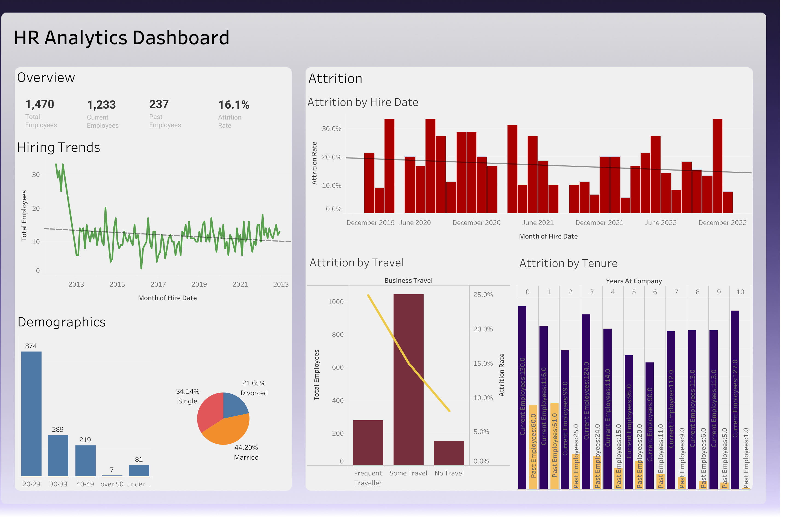

# HR Analytics Dashboard

A concise Tableau dashboard to monitor workforce **headcount, hiring trends, and attrition**.  
**Live demo:** [Open on Tableau Public](<https://public.tableau.com/app/profile/yash.raj.muthyapwar/viz/HR_Analytics_Workbook/HRDashboard>)

## Overview

This dashboard gives HR/People teams a fast pulse on:
- **KPI snapshot:** Total Employees, Current vs Past Employees, and overall **Attrition Rate**.
- **Hiring Trends:** Monthly hires with a trendline to spot momentum shifts.
- **Attrition Analysis:** By month of hire and key drivers like **Business Travel** and **Tenure**.
- **Demographics:** Age distribution and marital status mix.

> Screenshot above is a static preview. Click the image (or “Live demo”) to explore the interactive version.

## Data & Key Calculations

- **Dataset:** HR analytics practice dataset used for learning/demo.
- **Core fields:** Employee ID, Hire Date, Attrition (Yes/No), Business Travel, Years at Company, Age Group, Marital Status.
- **Derived metrics:**
  - `Attrition Flag = IIF([Attrition] = "Yes", 1, 0)`
  - **Attrition Rate =** `SUM([Attrition Flag]) / COUNT([Employee ID])`  
    *(formatted as Percentage; calculated per view context)*
  - **Current/Past Employees:** counts grouped by attrition status.
  - **Pie % (Demographics):** marks labeled via **Percent of Total** table calc.

## What’s on the Dashboard

- **Overview (KPI Tiles)** – quick glance: **Total = 1,470**, **Current = 1,233**, **Past = 237**, **Attrition = 16.1%**.
- **Hiring Trends** – monthly hires with a dashed trendline.
- **Attrition by Hire Date** – bars by month with a trendline to highlight direction.
- **Attrition by Travel** – dual-axis: bars (headcount) + line (attrition rate).
- **Attrition by Tenure** – clustered bars for **Current vs Past** by years at company.
- **Demographics** – age band bar chart and marital-status pie.

*(Numbers shown here match the example screenshot; your view will update with the data.)*

## How to Use

1. **Interactive filters** (if enabled on your Public view) let you slice by department, role, or demographics.
2. **Hover** to see tooltips and counts/percentages.
3. Use the **legends** to focus a specific segment.

## Attribution & License

- Built in **Tableau Public** for portfolio/learning purposes.  
- Data used is a sample HR dataset for demonstration only.  
- Code and assets in this repository are released under the **MIT License** (adjust if you prefer a different license).

Contributions welcome built with ❤️ to make HR insights effortless.
